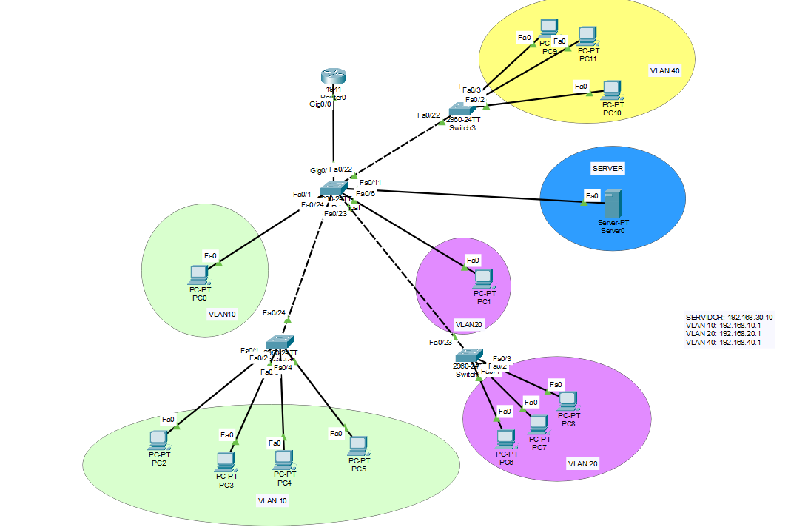

# Implementación de Red Jerárquica Inter-VLAN (Cisco Packet Tracer)

Este proyecto consiste en el diseño y configuración de una infraestructura de red corporativa segmentada mediante **VLANs**, utilizando el modelo de enrutamiento **Router-on-a-Stick** y servicios centralizados.

## 🚀 Características Técnicas
- **Segmentación L2:** Creación de 4 VLANs para separar el tráfico de administración, usuarios, servidores y recursos humanos.
- **Enrutamiento Inter-VLAN:** Configuración de subinterfaces en el router bajo el estándar **IEEE 802.1Q**.
- **Servicios DHCP:** Direccionamiento automático gestionado por un servidor central en la VLAN 30, implementando **DHCP Relay** mediante el comando `ip helper-address`.
- **Topología Jerárquica:** Uso de switches de distribución y acceso con enlaces **Trunk**.

## 📊 Tabla de Direccionamiento
| Red | VLAN | Gateway | Rango DHCP |
| :--- | :---: | :--- | :--- |
| **Administración** | 10 | 192.168.10.1 | 192.168.10.0/24 |
| **Usuarios** | 20 | 192.168.20.1 | 192.168.20.0/24 |
| **Servidores** | 30 | 192.168.30.1 | Estática (.30.10) |
| **RRHH** | 40 | 192.168.40.1 | 192.168.40.0/24 |

## 📸 Topología de la Red


## 🛠️ Configuración Destacada (DHCP Relay)
Uno de los puntos clave del proyecto fue la configuración del reenvío DHCP para la VLAN 40, asegurando que el tráfico de difusión llegara al servidor:
```bash
interface GigabitEthernet0/0.40
 encapsulation dot1Q 40
 ip address 192.168.40.1 255.255.255.0
 ip helper-address 192.168.30.10
